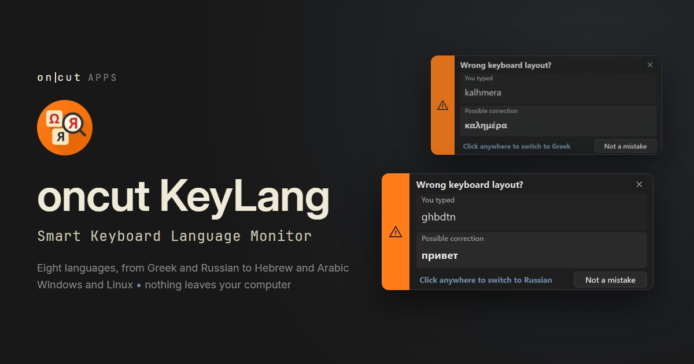

<p align="center">
  
</p>

# oncut KeyLang

**Smart Keyboard Language Monitor.** You meant `привет` and typed `ghbdtn`.
KeyLang notices after one word, shows you what you meant, and switches the
keyboard layout with a click. It lives in the system tray, and nothing you type
leaves your computer.

**Website and purchase:** <https://apps.oncut.gr/keylang>

> This repository carries KeyLang's releases and its issue tracker. KeyLang is
> proprietary software: the source code is not published here.

## What it does

- **Warns after one word.** Every word you finish is checked against word lists
  of 30,000 common words per language. It waits for a whole word, so an
  abbreviation or a password field does not set it off.
- **Switches with one click.** Click the warning and the application you are
  typing in changes layout. *Not a mistake* teaches KeyLang the word for good.
- **Fixes what you already typed.** Select text and press `Ctrl+Alt+Shift+R` to
  convert and replace it in place, capitals kept and Greek accents restored.
- **Eight languages.** Russian, Ukrainian, Greek, Hebrew, Arabic, German and
  French, each with English, and non-Latin layouts against each other, such as
  Hebrew and Greek. On Windows it also notices a Chinese Pinyin input method
  left on while you type English.
- **Stays out of the way.** No window, only a tray icon. Pause it, switch it off
  in chosen applications, start it when you sign in.
- **Nothing leaves your computer.** No telemetry, no crash uploads, no automatic
  updates. What you type is examined in memory and discarded.

## Editions

| | Windows 10 and 11 | Linux, X11 session | macOS |
| --- | --- | --- | --- |
| Price | EUR 9.90, VAT included, one payment | free | not yet |
| Trial | 14 days, same download | not needed | |
| License key | by email within one business day | none | |
| Package | installer, signed by oncut | AppImage | |

Buy at <https://apps.oncut.gr/keylang>. Refunds within 14 days, no questions
asked: <https://apps.oncut.gr/refunds>.

## Download

Get the current version from [Releases](../../releases) or from
<https://apps.oncut.gr/keylang>. Both carry the same files with the same
SHA-256 checksums.

- **Windows:** run the installer. It installs for your user account only,
  needs no administrator rights, and asks you to accept the End-User License
  Agreement. The installer and the application are signed by oncut
  (Authenticode).
- **Linux:** make the AppImage executable (`chmod +x oncut_KeyLang-*.AppImage`)
  and run it. It needs an X11 session; Wayland is not supported, because it lets
  no application see what is typed into other windows. On Ubuntu 24.04 an
  AppImage needs FUSE once: `sudo apt install libfuse2t64`.

### Checking a download

Each release comes with `SHA256SUMS`, signed by oncut with
[minisign](https://jedisct1.github.io/minisign/) in `SHA256SUMS.minisig`. The
public key is published at <https://apps.oncut.gr/keys>. In the folder with the
files:

```sh
minisign -Vm SHA256SUMS -P <public key from apps.oncut.gr/keys>
sha256sum -c --ignore-missing SHA256SUMS
```

Run them in that order. The first proves the checksum list comes from oncut; the
second proves your file matches it. The checksum alone only catches a broken
download.

The release key id is **`3AA1B9E2CD1C2AE8`**. It must match the one on
<https://apps.oncut.gr/keys>: the key and this README reach you by two
different routes, which is what makes the check worth doing.

## Requirements

- Windows 10 or 11 (64-bit), or Linux x86_64 in an X11 session.
- The keyboard layouts you type in, installed as usual.
- No administrator rights: the Windows installer installs for your user account only.

## Privacy

KeyLang has to see the keys you press to do its job. It checks them in memory
and discards them; it makes no network connections of its own and keeps no
record of what you type. The full notice: <https://apps.oncut.gr/privacy>.

## License

oncut KeyLang is proprietary software, licensed under its
[End-User License Agreement](https://apps.oncut.gr/keylang/eula). It ships with
Qt (LGPL-3.0) and FFmpeg (LGPL-2.1-or-later), dynamically linked and
replaceable; the Linux AppImage also bundles LGPL libraries from Ubuntu 24.04.
Their license texts travel inside every package, and the versions, source
archives and written offers are listed at
<https://apps.oncut.gr/keylang/licenses>.

## Support

- **Something does not work:** [open an issue](../../issues/new/choose). The
  tracker is public, so please do not paste text you typed, passwords or log
  files.
- **Purchases, license keys, refunds, privacy:** support@oncut.gr.
- **A security problem:** report it privately, as described in the
  [security policy](../../security/policy).

oncut KeyLang is made by oncut, Athens, Greece. Who we are:
<https://apps.oncut.gr/legal>.
